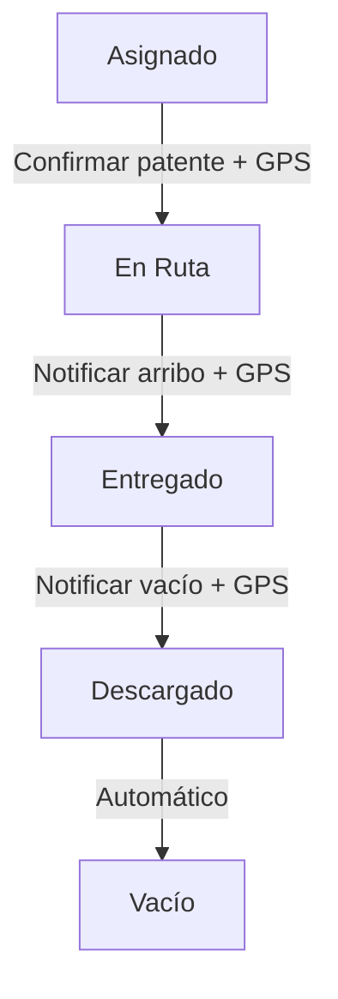

# 📋 Cambios Implementados - Importador y Portal del Conductor

## Resumen de Cambios

Este documento detalla los cambios realizados para solucionar tres problemas principales:

1. **Importador de Liberación**: Fecha incorrecta
2. **Exportación**: Formato incorrecto (JSON en vez de Excel)
3. **Portal del Conductor**: Falta confirmación de patente y notificaciones

---

## 1️⃣ Importador de Liberación - Fecha desde Excel

### Problema Original
- La fecha de liberación se tomaba de la fecha de carga del archivo (`timezone.now()`)
- Contenedores con fechas futuras se marcaban como "liberado" inmediatamente
- No se respetaba la fecha que venía en el Excel

### Solución Implementada
✅ **Archivo**: `apps/containers/importers/liberacion.py`

**Cambios principales**:
```python
# ANTES: Siempre usaba fecha actual
fecha_liberacion = timezone.now()

# AHORA: Lee fecha del Excel y valida
fecha_liberacion = pd.to_datetime(row['fecha_liberacion'])

# Solo marca como 'liberado' si la fecha es hoy o anterior
if fecha_liberacion <= timezone.now():
    nuevo_estado = 'liberado'
else:
    nuevo_estado = 'por_arribar'  # Fecha futura
```

**Resultados**:
- ✅ Contenedores con fecha actual o pasada → Estado: `liberado`
- ✅ Contenedores con fecha futura → Estado: `por_arribar`
- ✅ Nuevo contador `por_liberar` en resultados de importación

**Respuesta API actualizada**:
```json
{
  "success": true,
  "liberados": 15,
  "por_liberar": 8,
  "no_encontrados": 0,
  "errores": 0
}
```

---

## 2️⃣ Exportación a Excel

### Problema Original
- Confusión entre dos endpoints de exportación
- Posible uso del endpoint JSON en vez del Excel

### Solución Implementada
✅ **Archivo**: `apps/containers/views.py`

**Cambios**:
```python
# Agregado url_path explícito para evitar confusiones
@action(detail=False, methods=['get'], url_path='export-liberacion-excel')
def export_liberacion_excel(self, request):
    # Retorna archivo Excel con openpyxl
    
@action(detail=False, methods=['get'], url_path='export-stock')  
def export_stock(self, request):
    # Retorna JSON (clarificado en docstring)
```

**Endpoints disponibles**:
- ✅ `/api/containers/export-liberacion-excel/` → Descarga Excel
- ✅ `/api/containers/export-stock/` → Retorna JSON

**Templates actualizados**:
- `templates/containers_list.html` - Usa el endpoint correcto
- `templates/estados.html` - Usa el endpoint correcto

---

## 3️⃣ Portal del Conductor - Confirmación y Notificaciones

### Problema Original
- No había confirmación de patente al iniciar ruta
- Faltaban botones para notificar arribo y vacío
- No se registraba GPS al iniciar ruta

### Solución Implementada

#### 3.1 Nuevos Campos en Modelos

**Driver** (`apps/drivers/models.py`):
```python
patente = models.CharField(max_length=20, null=True, blank=True, 
                          verbose_name='Patente', 
                          help_text='Patente del vehículo asignado')
```

**Programacion** (`apps/programaciones/models.py`):
```python
patente_confirmada = models.CharField(max_length=20, null=True, blank=True,
                                     verbose_name='Patente Confirmada')
fecha_inicio_ruta = models.DateTimeField(null=True, blank=True,
                                         verbose_name='Fecha Inicio Ruta')
gps_inicio_lat = models.DecimalField(max_digits=9, decimal_places=6, 
                                    null=True, blank=True)
gps_inicio_lng = models.DecimalField(max_digits=9, decimal_places=6,
                                    null=True, blank=True)
```

#### 3.2 Endpoint `iniciar_ruta` Mejorado

**Archivo**: `apps/programaciones/views.py`

**Payload requerido**:
```json
{
  "patente": "ABC123",
  "lat": -33.4372,
  "lng": -70.6506
}
```

**Validaciones**:
1. ✅ Verifica que se proporcione patente
2. ✅ Si el conductor tiene patente asignada, valida coincidencia
3. ✅ Requiere GPS (lat, lng)
4. ✅ Registra evento con datos GPS

**Respuesta exitosa**:
```json
{
  "success": true,
  "mensaje": "Ruta iniciada por conductor Juan Pérez con patente ABC123",
  "patente_confirmada": "ABC123",
  "gps_registrado": {"lat": "-33.4372", "lng": "-70.6506"},
  "notificacion": { ... }
}
```

#### 3.3 Nuevos Endpoints de Notificación

**`POST /api/programaciones/{id}/notificar_arribo/`**
- Marca arribo al CD (estado → `entregado`)
- Registra GPS opcional
- Crea evento de auditoría

**`POST /api/programaciones/{id}/notificar_vacio/`**
- Marca contenedor vacío (estado → `vacio`)
- Registra GPS opcional
- Crea evento de auditoría

#### 3.4 Dashboard del Conductor Actualizado

**Archivo**: `templates/driver_dashboard.html`

**Nuevas funcionalidades**:

1. **Botón "Iniciar Ruta"** (estado = `asignado`):
   - Solicita patente con `prompt()`
   - Obtiene GPS automáticamente
   - Envía confirmación al servidor

2. **Botón "Notificar Arribo"** (estado = `en_ruta`):
   - Confirma llegada al CD
   - Obtiene GPS opcional
   - Cambia estado a `entregado`

3. **Botón "Notificar Vacío"** (estado = `entregado`):
   - Confirma contenedor vacío
   - Obtiene GPS opcional
   - Cambia estado a `vacio`

**Interfaz de confirmación**:
```javascript
// Ejemplo de flujo
confirmarInicioRuta(progId) {
  const patente = prompt('🚚 Confirme la PATENTE del vehículo...');
  // Valida patente
  // Obtiene GPS
  // Envía al servidor
}
```

---

## 📊 Flujo Completo del Conductor



**Estados y acciones**:

| Estado | Botón Visible | Acción | Nuevo Estado |
|--------|--------------|--------|--------------|
| `asignado` | ✅ Iniciar Ruta | Confirma patente + GPS | `en_ruta` |
| `en_ruta` | ✅ Notificar Arribo | Registra llegada + GPS | `entregado` |
| `entregado` | ✅ Notificar Vacío | Marca vacío + GPS | `vacio` |

---

## 🗄️ Migraciones Necesarias

Se crearon dos archivos de migración:

1. **`apps/drivers/migrations/0004_driver_patente.py`**
   - Agrega campo `patente` a Driver

2. **`apps/programaciones/migrations/0004_programacion_ruta_fields.py`**
   - Agrega `patente_confirmada`
   - Agrega `fecha_inicio_ruta`
   - Agrega `gps_inicio_lat`
   - Agrega `gps_inicio_lng`

**Para aplicar**:
```bash
python manage.py migrate drivers
python manage.py migrate programaciones
```

---

## ✅ Testing

### Test 1: Importador de Liberación
```bash
# Subir Excel con fechas futuras
curl -X POST http://localhost:8000/api/containers/import-liberacion/ \
  -F "file=@liberacion_futuras.xlsx"

# Verificar respuesta incluye "por_liberar"
# Verificar contenedores quedan en estado "por_arribar"
```

### Test 2: Exportación Excel
```bash
# Descargar Excel desde navegador
open http://localhost:8000/api/containers/export-liberacion-excel/

# Verificar formato Excel (.xlsx)
# Verificar 22 columnas con datos
```

### Test 3: Portal del Conductor
1. Login como conductor
2. Ver entrega asignada
3. Click "Iniciar Ruta"
4. Ingresar patente (ej: "ABC123")
5. Permitir GPS
6. Verificar estado cambia a "en_ruta"
7. Click "Notificar Arribo"
8. Verificar estado cambia a "entregado"
9. Click "Notificar Vacío"
10. Verificar estado cambia a "vacio"

---

## 📝 Notas Importantes

1. **GPS es requerido** para iniciar ruta (mejora el tracking)
2. **Patente es opcional** en el Driver model (puede estar vacía)
3. **Si hay patente asignada**, se valida al iniciar ruta
4. **Eventos de auditoría** se crean en cada paso
5. **Notificaciones** se pueden mejorar (push notifications futuro)

---

## 🔄 Próximos Pasos Sugeridos

- [ ] Agregar validación de formato de patente (ej: regex)
- [ ] Implementar push notifications reales
- [ ] Agregar fotos de contenedor en cada paso
- [ ] Dashboard de operaciones con mapa en tiempo real
- [ ] Reportes de cumplimiento de patentes

---

**Autor**: GitHub Copilot  
**Fecha**: 2025-10-14  
**Branch**: `copilot/fix-importer-and-export-functionality`
